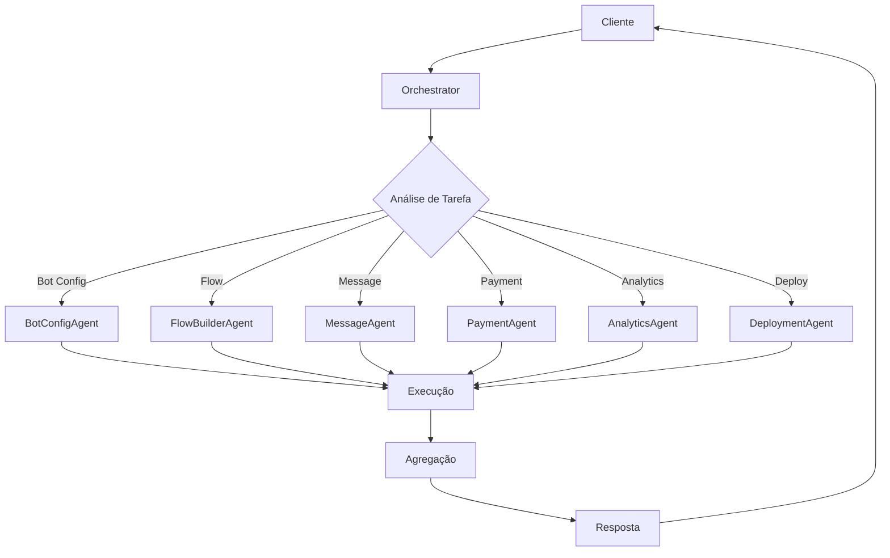

# 🤖 Sistema de Agents

## Visão Geral

O sistema de agents do TelegramBot Manager utiliza uma arquitetura modular onde cada agent é especializado em uma área específica do sistema. O **Agent Orchestrator** coordena todos os agents especializados.

## 🎯 Agent Orchestrator (Principal)

### Responsabilidades
- Analisar requisições e determinar qual agent deve processar
- Coordenar múltiplos agents para tarefas complexas
- Agregar resultados de diferentes agents
- Gerenciar prioridades e filas de execução

### Interface
```typescript
interface OrchestratorAgent {
  // Analisa a tarefa e determina quais agents usar
  analyzeTask(task: Task): AgentAssignment[]
  
  // Distribui trabalho para agents especializados
  distributeWork(assignments: AgentAssignment[]): Promise<Result[]>
  
  // Agrega resultados de múltiplos agents
  aggregateResults(results: Result[]): FinalOutput
  
  // Monitora status de execução
  monitorExecution(taskId: string): ExecutionStatus
}
```

### Exemplo de Uso
```typescript
// Requisição para criar um novo bot com fluxo
const task = {
  type: 'CREATE_BOT_WITH_FLOW',
  data: {
    botToken: 'xxx',
    flowTemplate: 'e-commerce',
    paymentGateway: 'mercadopago'
  }
}

// Orchestrator analisa e distribui
const assignments = orchestrator.analyzeTask(task)
// Retorna: [BotConfigAgent, FlowBuilderAgent, PaymentAgent]
```

## 1️⃣ BotConfigAgent

### Responsabilidades
- Validar tokens do BotFather
- Configurar webhooks do Telegram
- Gerenciar comandos do bot
- Configurar permissões e privacidade

### Métodos
```typescript
interface BotConfigAgent {
  validateToken(token: string): Promise<BotInfo>
  setupWebhook(botId: string, url: string): Promise<void>
  configureCommands(botId: string, commands: Command[]): Promise<void>
  updateBotSettings(botId: string, settings: BotSettings): Promise<void>
  healthCheck(botId: string): Promise<HealthStatus>
}
```

### Estrutura de Dados
```typescript
interface BotInfo {
  id: string
  username: string
  firstName: string
  canJoinGroups: boolean
  canReadAllGroupMessages: boolean
  supportsInlineQueries: boolean
}

interface Command {
  command: string
  description: string
  scope?: 'default' | 'all_private_chats' | 'all_group_chats'
}
```

## 2️⃣ FlowBuilderAgent

### Responsabilidades
- Criar e validar fluxos de conversação
- Otimizar estrutura de nodes e edges
- Gerar código executável do fluxo
- Detectar loops e problemas lógicos

### Métodos
```typescript
interface FlowBuilderAgent {
  createFlow(template: string): Flow
  validateFlow(flow: Flow): ValidationResult
  optimizeFlow(flow: Flow): Flow
  compileFlow(flow: Flow): ExecutableFlow
  testFlow(flow: Flow, testData: TestData): TestResult
}
```

### Tipos de Nodes
```typescript
type NodeType = 
  | 'start'           // Início do fluxo
  | 'message'         // Enviar mensagem
  | 'question'        // Fazer pergunta
  | 'condition'       // Condicional if/else
  | 'delay'          // Aguardar tempo
  | 'action'         // Executar ação
  | 'webhook'        // Chamar webhook
  | 'payment'        // Processar pagamento
  | 'end'            // Fim do fluxo

interface FlowNode {
  id: string
  type: NodeType
  data: any
  position: { x: number; y: number }
}
```

## 3️⃣ MessageAgent

### Responsabilidades
- Formatar mensagens para o Telegram
- Gerenciar templates de mensagens
- Processar variáveis dinâmicas
- Otimizar mídia (imagens, vídeos)

### Métodos
```typescript
interface MessageAgent {
  createMessage(template: string, variables: Variables): Message
  formatMessage(content: string, format: MessageFormat): FormattedMessage
  processMedia(media: Media): ProcessedMedia
  createKeyboard(buttons: Button[]): InlineKeyboard
  scheduleMessage(message: Message, schedule: Schedule): void
}
```

### Tipos de Mensagem
```typescript
interface Message {
  type: 'text' | 'photo' | 'video' | 'document' | 'audio'
  content: string
  parseMode?: 'HTML' | 'Markdown'
  replyMarkup?: InlineKeyboard | ReplyKeyboard
  media?: Media
}

interface Variables {
  [key: string]: string | number | boolean
}
```

## 4️⃣ PaymentAgent

### Responsabilidades
- Integrar com gateways de pagamento
- Gerar cobranças (PIX, boleto, cartão)
- Processar webhooks de pagamento
- Gerenciar reconciliação

### Métodos
```typescript
interface PaymentAgent {
  createPayment(data: PaymentData): Payment
  generatePixCode(amount: number, description: string): PixPayment
  processWebhook(webhook: WebhookData): PaymentStatus
  refundPayment(paymentId: string, amount?: number): RefundResult
  getPaymentStatus(paymentId: string): PaymentStatus
}
```

### Estrutura de Pagamento
```typescript
interface PaymentData {
  amount: number
  currency: 'BRL'
  method: 'pix' | 'credit_card' | 'boleto'
  description: string
  customerId: string
  metadata?: any
}

interface PixPayment {
  qrCode: string
  qrCodeBase64: string
  pixKey: string
  expiresAt: Date
}
```

## 5️⃣ AnalyticsAgent

### Responsabilidades
- Coletar métricas de uso
- Gerar relatórios e insights
- Analisar funil de conversão
- Predições e tendências

### Métodos
```typescript
interface AnalyticsAgent {
  trackEvent(event: Event): void
  generateReport(period: Period, metrics: string[]): Report
  analyzeConversion(funnelId: string): ConversionAnalysis
  predictTrend(metric: string, timeframe: number): Prediction
  getUserSegments(criteria: Criteria): Segment[]
}
```

### Métricas
```typescript
interface Metrics {
  totalUsers: number
  activeUsers: number
  messagesSent: number
  messagesReceived: number
  conversionRate: number
  averageSessionTime: number
  revenue: number
}

interface Event {
  name: string
  userId: string
  botId: string
  timestamp: Date
  properties?: any
}
```

## 6️⃣ DeploymentAgent

### Responsabilidades
- Deploy automático no Railway
- Gerenciar containers Docker
- Monitorar saúde da aplicação
- Rollback automático

### Métodos
```typescript
interface DeploymentAgent {
  deployToRailway(config: DeployConfig): DeployResult
  monitorHealth(serviceId: string): HealthMetrics
  rollback(deploymentId: string): void
  scaleService(serviceId: string, replicas: number): void
  updateEnvironment(serviceId: string, env: EnvVars): void
}
```

### Configuração Railway
```typescript
interface DeployConfig {
  projectId: string
  environment: 'production' | 'staging'
  services: ServiceConfig[]
  envVars: EnvVars
  autoScale?: AutoScaleConfig
}

interface ServiceConfig {
  name: string
  dockerfile: string
  port: number
  healthcheck?: string
  replicas?: number
}
```

## 🔄 Fluxo de Comunicação



## 📊 Priorização de Tarefas

```typescript
enum Priority {
  CRITICAL = 0,  // Falhas de sistema
  HIGH = 1,      // Pagamentos
  MEDIUM = 2,    // Configurações
  LOW = 3        // Analytics
}

interface TaskQueue {
  priority: Priority
  agent: string
  task: Task
  retries: number
  createdAt: Date
}
```

## 🛠️ Implementação

### Estrutura de Arquivos
```
backend/src/agents/
├── orchestrator/
│   ├── index.ts
│   ├── analyzer.ts
│   └── aggregator.ts
├── bot-config/
│   ├── index.ts
│   ├── validator.ts
│   └── webhook.ts
├── flow-builder/
│   ├── index.ts
│   ├── compiler.ts
│   └── optimizer.ts
├── message/
│   ├── index.ts
│   ├── formatter.ts
│   └── templates.ts
├── payment/
│   ├── index.ts
│   ├── gateways/
│   └── reconciliation.ts
├── analytics/
│   ├── index.ts
│   ├── metrics.ts
│   └── reports.ts
└── deployment/
    ├── index.ts
    ├── railway.ts
    └── monitoring.ts
```

### Exemplo de Agent

```typescript
// backend/src/agents/bot-config/index.ts
import { Agent } from '../types'
import { TelegramAPI } from '../../services/telegram'
import { Database } from '../../services/database'

export class BotConfigAgent implements Agent {
  private telegram: TelegramAPI
  private db: Database

  constructor() {
    this.telegram = new TelegramAPI()
    this.db = new Database()
  }

  async execute(task: Task): Promise<Result> {
    switch (task.action) {
      case 'VALIDATE_TOKEN':
        return this.validateToken(task.data.token)
      case 'SETUP_WEBHOOK':
        return this.setupWebhook(task.data)
      case 'CONFIGURE_COMMANDS':
        return this.configureCommands(task.data)
      default:
        throw new Error(`Ação não suportada: ${task.action}`)
    }
  }

  private async validateToken(token: string) {
    try {
      const bot = await this.telegram.getMe(token)
      await this.db.saveBot(bot)
      return { success: true, data: bot }
    } catch (error) {
      return { success: false, error: error.message }
    }
  }

  private async setupWebhook(data: any) {
    const { botId, url } = data
    const bot = await this.db.getBot(botId)
    
    await this.telegram.setWebhook(bot.token, url)
    await this.db.updateBot(botId, { webhookUrl: url })
    
    return { success: true }
  }

  private async configureCommands(data: any) {
    const { botId, commands } = data
    const bot = await this.db.getBot(botId)
    
    await this.telegram.setMyCommands(bot.token, commands)
    await this.db.updateBot(botId, { commands })
    
    return { success: true }
  }
}
```

## 🧪 Testes

### Teste de Agent
```typescript
// backend/src/agents/__tests__/bot-config.test.ts
describe('BotConfigAgent', () => {
  let agent: BotConfigAgent

  beforeEach(() => {
    agent = new BotConfigAgent()
  })

  it('should validate bot token', async () => {
    const result = await agent.execute({
      action: 'VALIDATE_TOKEN',
      data: { token: 'valid-token' }
    })

    expect(result.success).toBe(true)
    expect(result.data).toHaveProperty('username')
  })

  it('should handle invalid token', async () => {
    const result = await agent.execute({
      action: 'VALIDATE_TOKEN',
      data: { token: 'invalid-token' }
    })

    expect(result.success).toBe(false)
    expect(result.error).toBeDefined()
  })
})
```

## 📈 Monitoramento

### Métricas por Agent
```typescript
interface AgentMetrics {
  agentName: string
  tasksProcessed: number
  successRate: number
  averageTime: number
  errors: number
  lastError?: string
  uptime: number
}
```

### Dashboard de Agents
- Status de cada agent
- Taxa de sucesso
- Tempo médio de processamento
- Fila de tarefas
- Logs de erro

## 🔒 Segurança

### Validações
- Sanitização de inputs
- Rate limiting por agent
- Timeout de execução
- Isolamento de falhas

### Permissões
```typescript
interface AgentPermissions {
  canAccessDatabase: boolean
  canCallExternalAPIs: boolean
  canModifySystem: boolean
  maxExecutionTime: number
  maxMemoryUsage: number
}
```

## 📚 Recursos Adicionais

- [Telegram Bot API Documentation](https://core.telegram.org/bots/api)
- [Railway API Reference](https://docs.railway.app/reference/api)
- [MercadoPago API](https://www.mercadopago.com.br/developers)
- [Node.js Best Practices](https://github.com/goldbergyoni/nodebestpractices)