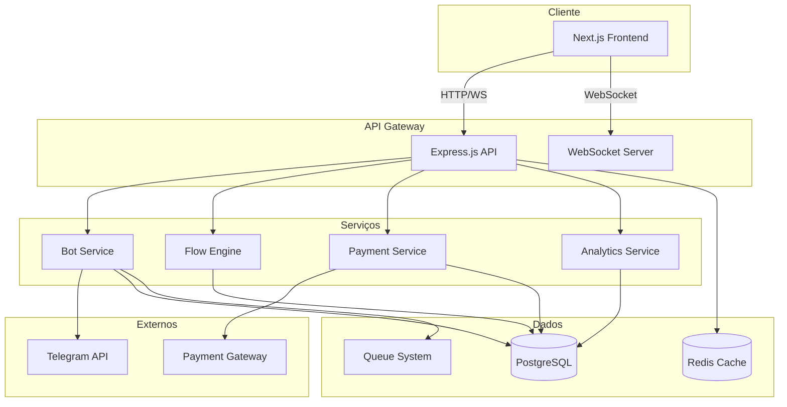

# 🏗️ Arquitetura do Sistema

## Visão Geral

O TelegramBot Manager segue uma arquitetura modular e escalável, separando responsabilidades entre frontend, backend e serviços auxiliares.



## 📦 Componentes Principais

### 1. Frontend (Next.js)

**Responsabilidades:**
- Interface do usuário
- State management com Zustand
- Comunicação real-time via WebSocket
- Renderização server-side (SSR)
- Cache de dados com React Query

**Estrutura:**
```
frontend/src/
├── components/       # Componentes reutilizáveis
│   ├── ui/          # Componentes base (buttons, cards)
│   ├── layouts/     # Layouts de página
│   └── features/    # Componentes de funcionalidades
├── pages/           # Rotas da aplicação
├── services/        # Comunicação com API
├── hooks/           # Custom hooks
├── styles/          # Estilos globais e tema
├── lib/            # Utilitários
└── types/          # TypeScript types
```

### 2. Backend (Express.js)

**Responsabilidades:**
- API RESTful
- Autenticação e autorização
- Validação de dados
- Gerenciamento de WebSockets
- Processamento de jobs

**Estrutura:**
```
backend/src/
├── api/            # Rotas e controllers
│   ├── auth/
│   ├── bots/
│   ├── flows/
│   ├── messages/
│   └── payments/
├── services/       # Lógica de negócio
├── models/         # Modelos Prisma
├── middlewares/    # Middlewares Express
├── utils/          # Funções auxiliares
└── config/         # Configurações
```

## 🔄 Fluxo de Dados

### 1. Criação de Bot

```sequence
User -> Frontend: Insere token do bot
Frontend -> API: POST /api/bots
API -> TelegramAPI: Valida token
TelegramAPI -> API: Retorna info do bot
API -> Database: Salva bot
API -> Queue: Adiciona job de setup
Queue -> BotService: Processa setup
BotService -> TelegramAPI: Configura webhook
API -> Frontend: Retorna bot criado
```

### 2. Editor de Fluxos

```sequence
User -> FlowEditor: Cria fluxo visual
FlowEditor -> WebSocket: Envia alterações
WebSocket -> FlowEngine: Processa fluxo
FlowEngine -> Database: Salva fluxo
FlowEngine -> Cache: Atualiza cache
WebSocket -> FlowEditor: Confirma salvamento
```

### 3. Processamento de Mensagens

```sequence
Telegram -> Webhook: Mensagem do usuário
Webhook -> BotService: Processa mensagem
BotService -> FlowEngine: Busca fluxo ativo
FlowEngine -> Cache: Verifica estado
FlowEngine -> BotService: Retorna próxima ação
BotService -> MessageService: Prepara resposta
MessageService -> Telegram: Envia resposta
BotService -> Analytics: Registra evento
```

## 🗄️ Modelo de Dados

### Principais Entidades

```typescript
// Usuário
interface User {
  id: string
  email: string
  name: string
  plan: 'free' | 'pro' | 'enterprise'
  createdAt: Date
}

// Bot
interface Bot {
  id: string
  userId: string
  token: string
  username: string
  name: string
  active: boolean
  webhookUrl: string
  settings: JsonValue
}

// Fluxo
interface Flow {
  id: string
  botId: string
  name: string
  nodes: JsonValue
  edges: JsonValue
  active: boolean
  version: number
}

// Mensagem
interface Message {
  id: string
  flowId: string
  type: 'text' | 'image' | 'video' | 'document'
  content: string
  metadata: JsonValue
}

// Conversa
interface Conversation {
  id: string
  botId: string
  telegramUserId: string
  state: JsonValue
  currentNode: string
  startedAt: Date
}
```

## 🔐 Segurança

### Autenticação

- **JWT Tokens** para autenticação stateless
- **Refresh Tokens** armazenados no Redis
- **2FA** opcional com TOTP

### Autorização

- **RBAC** (Role-Based Access Control)
- **Políticas de acesso** por recurso
- **Rate limiting** por endpoint

### Criptografia

- **Passwords** com bcrypt
- **Tokens de bot** criptografados em repouso
- **HTTPS** obrigatório em produção

## ⚡ Performance

### Cache Strategy

```typescript
// Cache em múltiplas camadas
1. Browser Cache (React Query)
2. CDN Cache (Cloudflare)
3. Redis Cache (Server-side)
4. Database Query Cache
```

### Otimizações

- **Code splitting** no frontend
- **Lazy loading** de componentes
- **Image optimization** com Next.js
- **Database indexes** otimizados
- **Connection pooling**

## 🚀 Escalabilidade

### Horizontal Scaling

```yaml
# Múltiplas instâncias
- Frontend: 2-10 instâncias
- API: 2-20 instâncias
- Workers: 1-5 instâncias
```

### Vertical Scaling

```yaml
# Recursos por container
- Frontend: 512MB - 1GB RAM
- API: 1GB - 2GB RAM
- Database: 2GB - 8GB RAM
- Redis: 512MB - 2GB RAM
```

## 📊 Monitoramento

### Métricas

- **APM** com DataDog/New Relic
- **Logs** centralizados com ELK
- **Uptime** monitoring
- **Error tracking** com Sentry

### Alertas

- CPU > 80%
- Memory > 90%
- Response time > 2s
- Error rate > 1%
- Database connections > 80%

## 🔄 CI/CD Pipeline

```yaml
1. Code Push -> GitHub
2. Run Tests (Jest, Cypress)
3. Build Docker Images
4. Push to Registry
5. Deploy to Railway
6. Run Health Checks
7. Rollback if needed
```

## 🎯 Design Patterns

### Backend

- **Repository Pattern** para acesso a dados
- **Service Layer** para lógica de negócio
- **Factory Pattern** para criação de bots
- **Observer Pattern** para eventos
- **Strategy Pattern** para processamento de mensagens

### Frontend

- **Component Composition**
- **Custom Hooks** para lógica reutilizável
- **Context API** para estado global
- **HOC** para funcionalidades compartilhadas
- **Render Props** para componentes flexíveis

## 📝 Convenções

### Código

- **TypeScript** strict mode
- **ESLint** + **Prettier**
- **Conventional Commits**
- **Semantic Versioning**

### API

- **RESTful** design
- **Versionamento** via header
- **Paginação** padrão
- **Filtros** consistentes

## 🔧 Desenvolvimento

### Ambiente Local

```bash
# Backend
npm run dev       # Desenvolvimento
npm run build     # Build
npm run test      # Testes
npm run lint      # Linting

# Frontend
npm run dev       # Desenvolvimento
npm run build     # Build
npm run test      # Testes
npm run storybook # Storybook
```

### Debugging

- **Chrome DevTools** para frontend
- **VS Code Debugger** para backend
- **Prisma Studio** para database
- **Redis Commander** para cache

## 📚 Recursos

- [Next.js Documentation](https://nextjs.org/docs)
- [Express.js Guide](https://expressjs.com/guide)
- [Prisma Documentation](https://www.prisma.io/docs)
- [Telegram Bot API](https://core.telegram.org/bots/api)
- [Railway Documentation](https://docs.railway.app)